# Deep Reinforcement Learning Laboratory
This third laboratory is dedicated to the analysis of Deep Reinforcement Learning
techniques to train different agents to play games such as Cartpole or LunarLander.
We investigated the performances of two algorithms:
* Reinforce
* Deep Q-Learning

## Exercise 1
The first exercise consists of a basic implementation of the `REINFORCE` algorithm.
This algorithm is designed to optimize the parameters of policy by 
maximizing the expected reward. The core idea is to adjust the policy parameters in 
a way that actions leading to higher returns are more likely to be taken in 
the future.

The code is available in `Exercise1.py`

In these first experiments we trained our model with 1000 episodes and we monitored 
the running and average rewards.
<p float="left">
  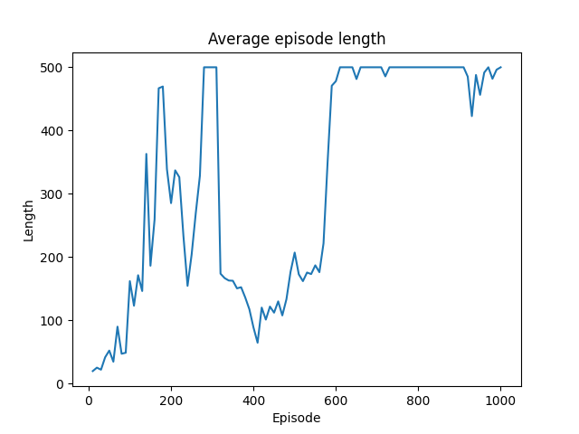
  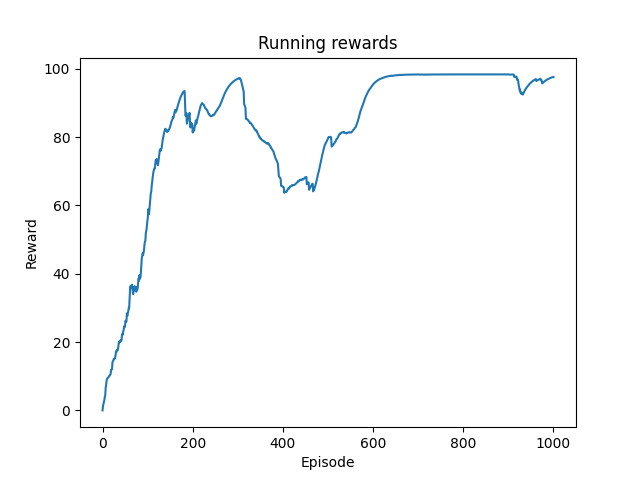
</p>

<div style="text-align: center;">
    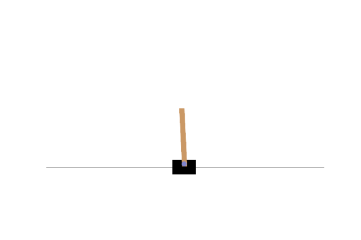
</div>


## Exercise 2
In this second exercise the implementation of `REINFORCE` is augmented by 
subtracting a baseline from the target in the update equation in order to 
stabilize and speed-up convergence. 
As in the previous exercise we applied this algorithm to solve the Cartpole environment.

The code is available in `Exercise2.py`

We run experiments with and without this standardization baseline and compare the 
performances. 
### Results without standardization
<p float="left">
  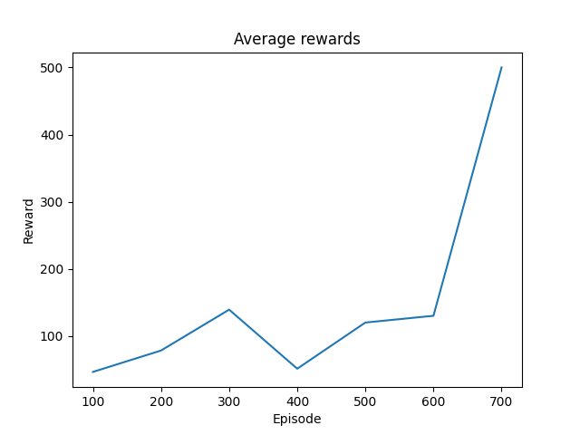
  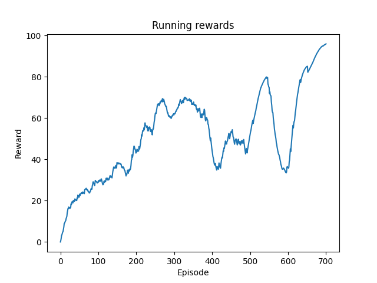
</p>
<div style="text-align: center;">
    
</div>

### Results with standardization
<p float="left">
  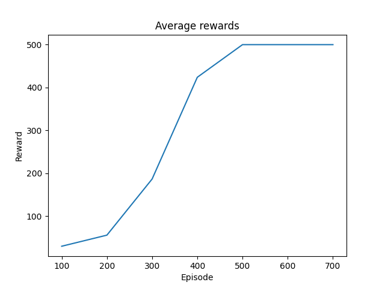
  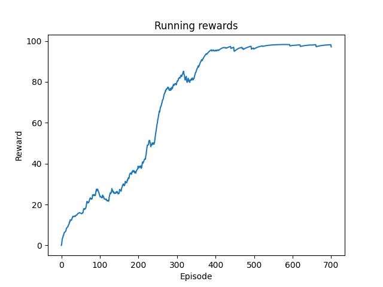
</p>
<div style="text-align: center;">
    
</div>

As these graphs suggest, standardization stabilizes training, allowing the 
algorithm to converge already after 400-500 episodes.
Furthermore, comparing these results with those of the previous exercise, 
it is also observed that the introduction of the value baseline significantly 
accelerates and stabilizes the training.

## Exercise 3.1
In this exercise we applied the previous algorithm to a harder environment which 
is the [Lunar Lander](https://gymnasium.farama.org/environments/box2d/lunar_lander/).

Results are shown below. Since the documentation reports that an episode
is considered a solution if it scores at least 200 points, the 
environment cannot be considered resolved. In fact, even observing the 
qualitative results, we note that the agent has difficulties to land.

<p float="left">
    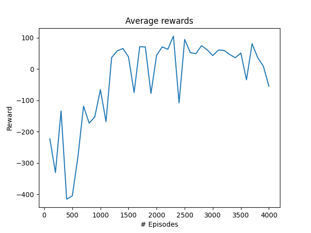
    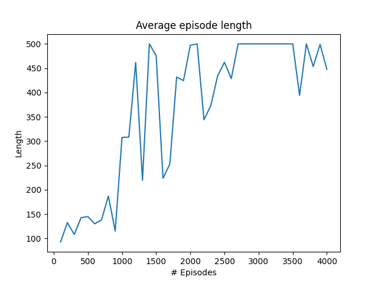
</p>


<div style="text-align: center;">
    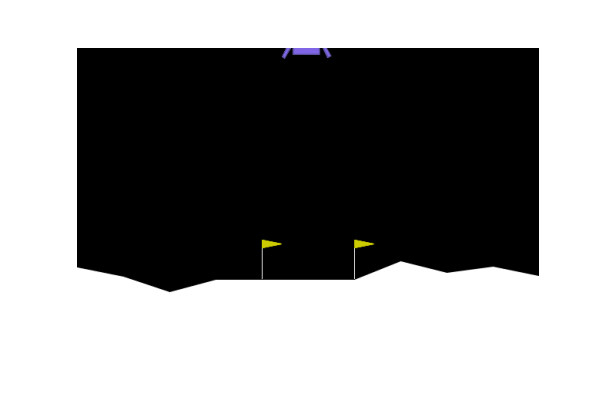
</div>

## Exercise 3.2
In this exercise we implemented `Deep Q-Learning` to solve the two environments 
(Cartpole and Lunar Lander). 
To do this we had implemented a **ReplayMemory** to store the transitions that 
the agent observes, allowing us to reuse this data later.  

The main idea behind Q-learning is to learn a function
$ Q^*: State \times Action \rightarrow \mathbb{R} $, that could tell us 
what our return would be, if we were to take an action in a given
state using a neural network.
 
Our Q-Network a feed forward neural network that takes in the 
difference between the current and previous screen patches.

```
class DQN(nn.Module):

    def __init__(self, n_observations, n_actions):
        super(DQN, self).__init__()
        self.layer1 = nn.Linear(n_observations, 128)
        self.layer2 = nn.Linear(128, 128)
        self.layer3 = nn.Linear(128, n_actions)

    # Called with either one element to determine next action, or a batch
    # during optimization. Returns tensor([[left0exp,right0exp]...]).
    def forward(self, x):
        x = F.relu(self.layer1(x))
        x = F.relu(self.layer2(x))
        return self.layer3(x)
```
The same architecture is used for both the `policy_net` and the 
`target_net`. 
The target net is updated using a soft update of weights 
$$\theta_t \leftarrow \tau \cdot \theta_p + (1-\tau)\cdot\theta_t$$ where 
$\theta_p$ are the parameters of the policy network, $\theta_t$ target network 
ones and $\tau \in (0,1)$ is the update rate.

### Cartpole Results
The algorithm is able to solve the environmnet in around 350-370 episodes.

| 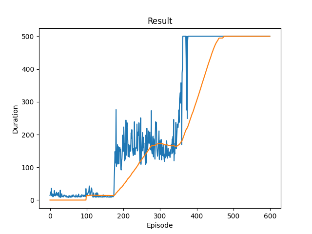                                                                                                                  | 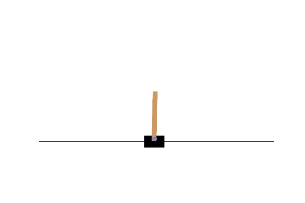 |
|-------------------------------------------------------------------------------------------------------------------------------------------------------------------------------|--------------------------------------------------------------------------|
| Graph showing the average the episode reward/ length. The orange line refers to the average reward over the last 100 episodes (the measure used in the official evaluations). | Qualitative evalutation of the agent that solves the environment         |

### LunarLander Results
The algorithm is able to solve the environmnet since the reward stabilizes around the value 300.
As the .gif shows the lander is able to land safely.

| 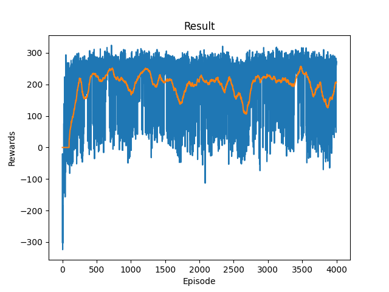                                                     | 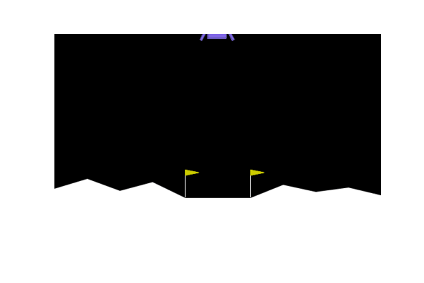 |
|----------------------------------------------------------------------------------------------------------------------|--------------------------------------------------------------------------------------|
| Graph showing the rewards for each episode. The orange line refers to the average reward over the last 100 episodes. | Qualitative evalutation of the agent that solves the environment.                    |


